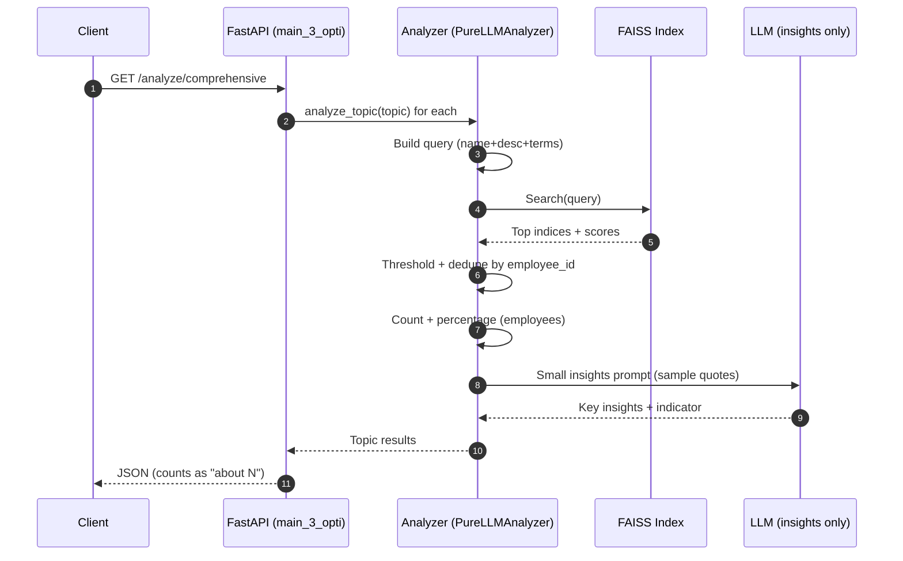
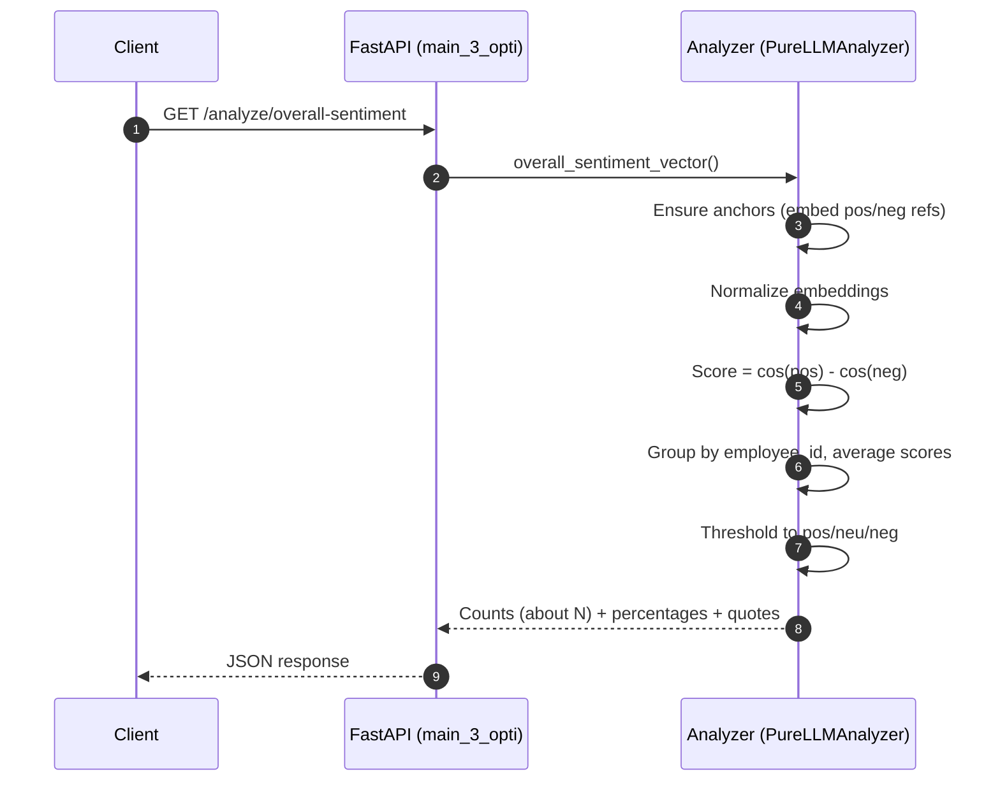

# High‑Level Architecture & Approach (Data Pipeline)

This document describes the end‑to‑end pipeline, architectural components, and trade‑offs for the vectorized survey analysis implemented in `main_3_opti.py`.

## Goals

- Provide fast, scalable analysis of open‑ended survey responses using vector embeddings + FAISS.
- Generate topics dynamically and produce per‑topic insights with minimal latency.
- Offer overall sentiment using a vector‑anchored approach (no per‑response LLM classification).
- Keep outputs human‑friendly via respondent‑level counts and “about N” rounding.

## High‑Level Flow

```
Client (HTTP)
   |
   v
FastAPI app (main_3_opti.py)
   |
   |-- /analyze/process  --> NAHandler.clean_and_prepare_data()
   |                       Extract responses + metadata
   |                       └─> Embed all responses (OpenAI embeddings)
   |                           Build FAISS index (cosine via normalized IP)
   |
   |-- /analyze/topics   --> LLM generates dataset‑specific topics
   |
   |-- /analyze/comprehensive
   |       For each topic:
   |         ├─ Vector search (FAISS) for candidates (fast)
   |         ├─ Count = unique employees mentioning topic
   |         ├─ Percentage = Count / total employees
   |         └─ Small LLM prompt for insights + indicator (on top examples)
   |
   └-- /analyze/overall-sentiment
           Vector‑anchored sentiment:
             - Create positive/negative anchor vectors once
             - Score responses via cos(pos) - cos(neg)
             - Aggregate to employee‑level labels (pos/neu/neg)
             - Report counts (about N) and percentages
```

## Key Components

- `main_3_opti.PureLLMAnalyzer`
  - Embeddings + FAISS index construction.
  - Topic generation via LLM sampling.
  - Topic analysis via vector search (respondent‑level counts), with LLM only for insights text.
  - Vector‑anchored overall sentiment (no LLM classification).
- `services/na_handler.NAHandler`
  - Cleans and normalizes uploaded data (e.g., fills “No response provided”).

## Data Model & Caches

- Responses: `self.survey_responses: List[str]`
- Metadata: `self.response_metadata: List[Dict]` with `employee_id`, `question_type`, `response_text`.
- Embeddings: `self.embeddings: np.ndarray[float32]`
- FAISS index: `self.faiss_index: IndexFlatIP` over normalized embeddings.

## Endpoints

- `/analyze/process`
  - Reads file (CSV/XLSX), cleans via `NAHandler`, extracts responses + metadata.
  - Creates embeddings (OpenAI `text-embedding-3-small`, dim=1536).
  - Normalizes vectors; builds FAISS IP index (cosine on normalized vectors).

- `/analyze/topics`
  - Randomly samples responses; prompts LLM to produce 6–10 dataset‑specific topics with names/descriptions/search terms.

- `/analyze/comprehensive`
  - Vector‑first counting:
    - Builds a topic query from name + description + search terms.
    - FAISS search → candidate hits with similarity.
    - Calibrates threshold (30th percentile floor ~0.35) to filter noise.
    - Dedupe by `employee_id` for counts; compute percentage over total employees.
    - “About N” counts: exact if <10, else nearest‑5 rounding.
    - Small LLM prompt on a few top quotes for key insights + indicator.

- `/analyze/overall-sentiment`
  - Vector‑anchored sentiment only:
    - Build positive/negative anchor vectors from reference phrases (once).
    - Score each response by cos(pos) − cos(neg).
    - Aggregate per employee (average), then threshold to pos/neu/neg.
    - Report employee‑level counts (about N) and percentages.

## Why This Approach

- Speed: Vector search (FAISS) is sub‑linear and CPU‑efficient; avoids classifying every response via LLM.
- Cost: Limits LLM usage to lightweight prompts for topics and per‑topic insights, not per‑response labeling.
- Interpretability: Counts are respondent‑level; percentages over total employees, which is easier to interpret.
- Stability: Vector‑anchored sentiment is consistent across runs and large datasets.

## Trade‑offs

Strengths
- Fast counts at scale using FAISS (thousands to hundreds of thousands of responses).
- Minimal LLM usage (topics + insight generation only).
- Robust to small prompt variations; vector thresholds are deterministic.

Limitations
- Vector counts are approximate; borderline matches may require tuning.
- Vector‑anchored sentiment is less nuanced than a strong LLM classifier.
- Anchors/thresholds may need light calibration per domain/language.

Mitigations
- Hybrid mode (future): vector pre‑filter + LLM verification for hits near the threshold.
- Cache embeddings/FAISS on disk to accelerate repeated runs.
- Topic‑specific thresholds and/or synonyms.

## Configuration & Tunables

- Embedding model: `text-embedding-3-small`
- Thresholding: 30th‑percentile similarity floor with 0.35 minimum.
- Rounding: counts exact if `< 10`; else nearest‑5 (“about N”).
- Sentiment anchors: a compact list of positive/negative reference phrases.
- Sentiment thresholds: defaults `+0.15 / −0.15` on employee‑average score.

## Good, Bad, and Workings (main_3_opti)

- Good
  - Fast, scalable counts via FAISS; minimal LLM spend.
  - Clear, respondent‑level metrics; user‑friendly “about N”.
  - Vector‑anchored sentiment removes heavy per‑response LLM dependency.

- Bad / Considerations
  - Approximate counts may over/under‑include borderline hits.
  - Sentiment anchors are generic; domain‑tuned anchors improve accuracy.
  - Mixed‑language or domain‑specific jargon may need extra synonyms.

- Workings Summary
  1) Upload → clean → embed → index.
  2) LLM proposes topics from a small response sample.
  3) For each topic: FAISS search → respondent‑level count → short LLM insights.
  4) Overall sentiment: vector‑anchored, aggregated per employee.

## Future Enhancements

- Hybrid verification: LLM classification only for hits near threshold.
- Disk caching for embeddings and FAISS index (hash by dataset/version).
- IVF/HNSW FAISS indexes for very large datasets.
- Auto‑calibrate thresholds per topic from similarity distributions.
- Cluster‑driven topic discovery (KMeans/HDBSCAN) + LLM labeling.

## Diagrams

### System Flow (Mermaid)

```mermaid
flowchart TD
    A[Client] --> B[FastAPI: main_3_opti]
    subgraph Ingestion
      B --> C[/POST /analyze/process/]
      C --> D[NAHandler.clean_and_prepare_data]
      D --> E[Embed all responses\n(OpenAI embeddings)]
      E --> F[Normalize + build FAISS index]
    end

    subgraph Topics
      B --> G[/GET /analyze/topics/]
      G --> H[LLM topic discovery\n(sample from responses)]
    end

    subgraph Per-Topic Analysis
      B --> I[/GET /analyze/comprehensive/]
      I --> J[Build topic query\n(name + desc + terms)]
      J --> K[FAISS search\n(semantic candidates)]
      K --> L[Calibrate threshold\n(30th pct / 0.35 floor)]
      L --> M[Respondent-level count\n(unique employee_id)]
      M --> N[Percentage over total employees]
      N --> O[Small LLM prompt\n(insights + indicator)]
    end

    subgraph Overall Sentiment
      B --> P[/GET /analyze/overall-sentiment/]
      P --> Q[Build sentiment anchors\n(positive/negative refs)]
      Q --> R[Score responses\ncos(pos)-cos(neg)]
      R --> S[Aggregate per employee\n(avg + thresholds)]
      S --> T[Counts (about N) + %]
    end

    O --> U[API Response]
    T --> U
    U --> A
```

### Sequence: Comprehensive Analysis



### Sequence: Overall Sentiment (Vector‑Anchored)


