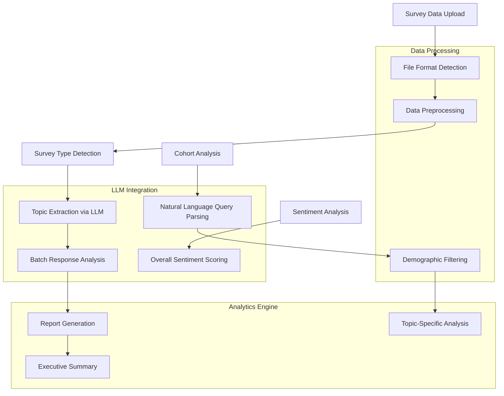
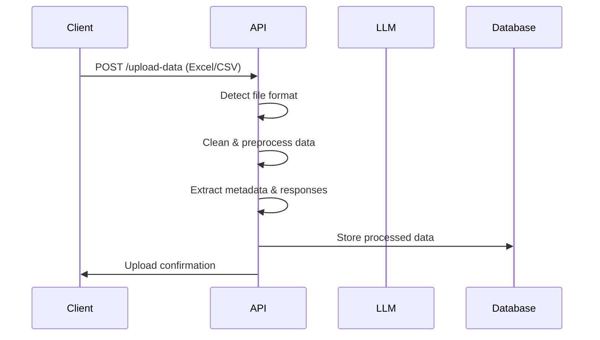
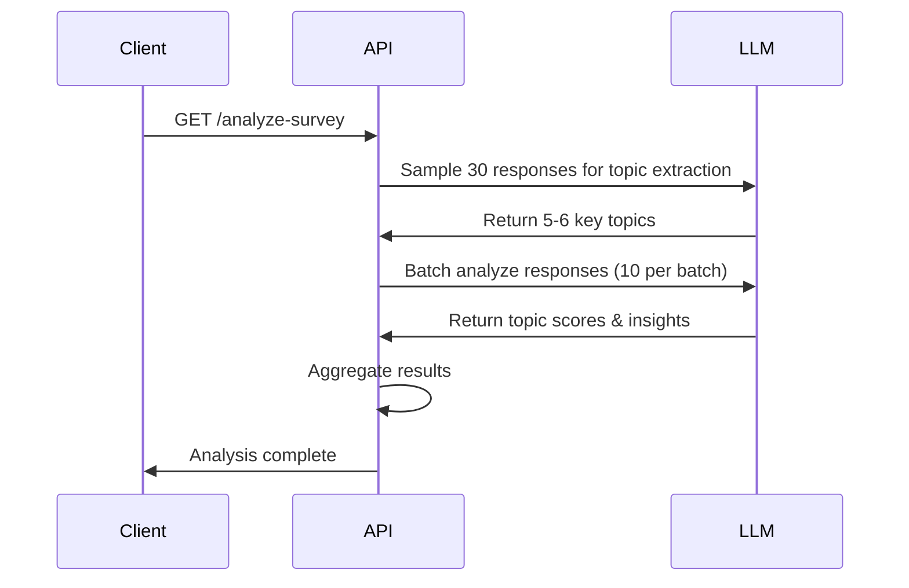
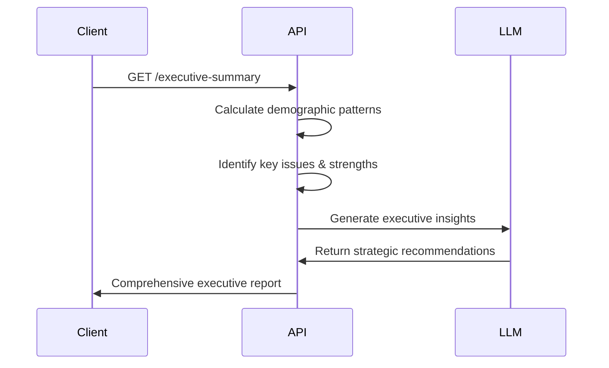
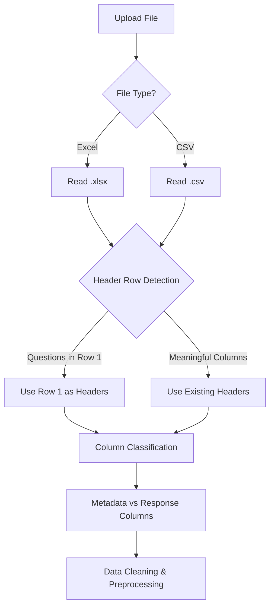
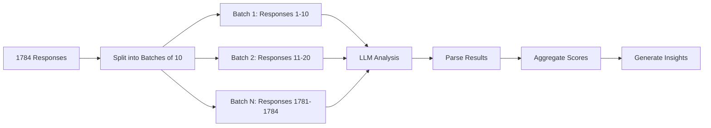
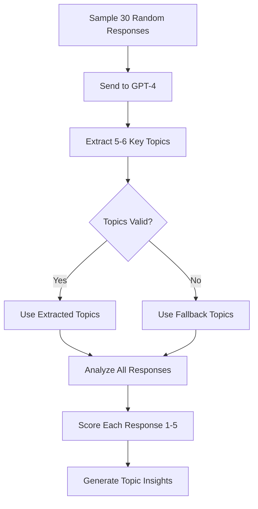

# 🔍 Survey Analysis API

**Enterprise-scale survey analysis system with LLM-powered insights, cohort analysis, and executive reporting.**

[](https://python.org)
[](https://fastapi.tiangolo.com)
[](https://openai.com)

## 📋 Table of Contents
- [Overview](#overview)
- [Key Features](#key-features)
- [Architecture](#architecture)
- [API Workflow](#api-workflow)
- [Setup Instructions](#setup-instructions)


## 🎯 Overview

This API transforms raw survey data into actionable business insights using advanced LLM technology. It processes large-scale employee surveys (1000+ responses) and provides comprehensive analysis including sentiment analysis, topic extraction, demographic insights, and executive-level recommendations.

### 🏢 Built For
- **HR Teams** - Employee engagement analysis
- **Management** - Strategic decision making
- **Researchers** - Survey data analysis
- **Consultants** - Client reporting

## ✨ Key Features

### 🤖 **LLM-Powered Analysis**
- **Topic Extraction**: Automatically identifies key themes from survey responses
- **Sentiment Analysis**: Comprehensive positive/negative sentiment scoring
- **Natural Language Cohort Queries**: Ask questions like "What do female employees with >5 years experience think about leadership?"

### 📊 **Advanced Analytics**
- **Batch Processing**: Handles 1000+ responses efficiently (5-10 minutes vs 45+ minutes)
- **Demographic Insights**: Analyzes patterns across departments, tenure, gender, etc.
- **Statistical Significance**: Identifies meaningful differences between groups

### 📈 **Executive Reporting**
- **Executive Summary**: Comprehensive insights combining all analysis
- **Actionable Recommendations**: Prioritized improvement strategies
- **Business Impact Analysis**: Risk identification and opportunity mapping

### 🔧 **Enterprise Ready**
- **Multiple File Formats**: Excel (.xlsx), CSV support
- **Large Dataset Support**: Optimized for 1000+ responses
- **Flexible Data Structure**: Handles various survey formats automatically

## 🏗️ Architecture



## 🔄 API Workflow

### **Phase 1: Data Ingestion & Processing**


### **Phase 2: Analysis Pipeline**


### **Phase 3: Insights & Reporting**


## 🚀 Setup Instructions

### **Prerequisites**
- Python 3.8+
- OpenAI API key
- 4GB+ RAM (for large datasets)

### **1. Clone Repository**
```bash
git clone https://github.com/Kss004/BackendSurveryPipeline
```

### **2. Install Dependencies**
```bash
pip install -r requirements.txt
```

### **3. Environment Configuration**
Create `.env` file:
```
OPENAI_API_KEY=YOUR_OPENAI_API_KEY
EMBEDDING_MODEL= EMBEDDING_MODEL (Optional)
LLM_MODEL=gpt-4o-mini (Optional)
```

### **4. Run Application**
```bash
uvicorn main_4_cohort:app      
```

### **5. Access API Documentation**
Visit: `http://localhost:8000/docs`

## 🔧 Data Processing Pipeline

### **File Format Detection**


### **Batch Processing Strategy**


### **Topic Extraction Process**

