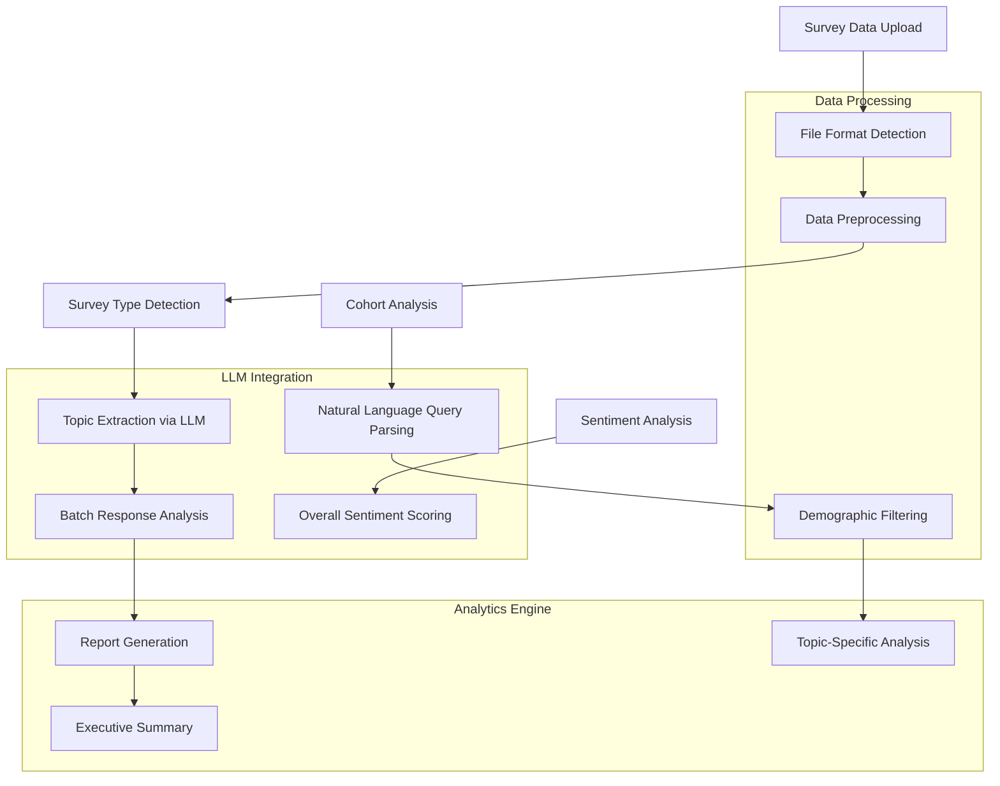
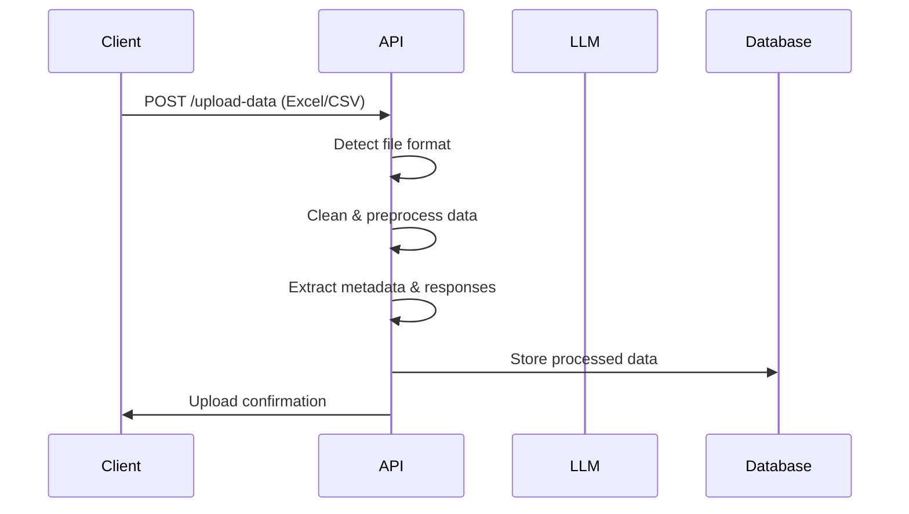
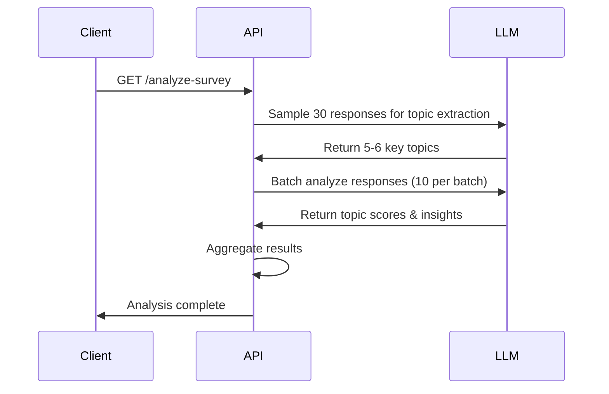
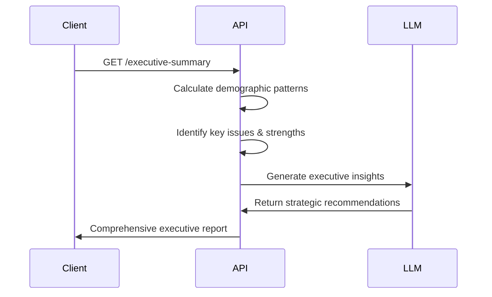
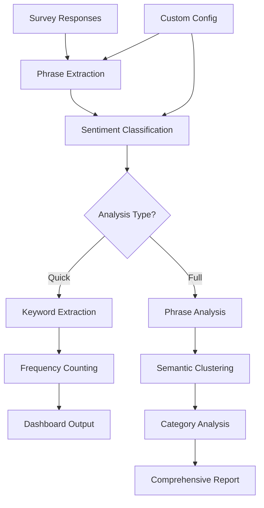
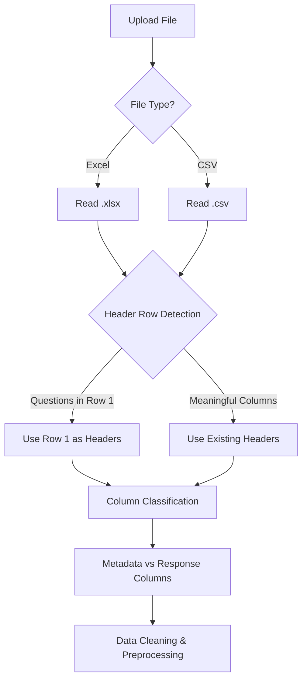
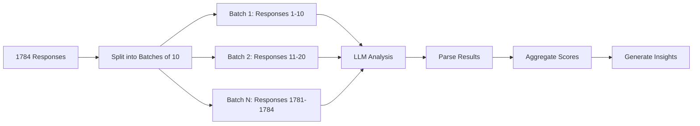

# 🔍 Survey Analysis API

**Enterprise-scale survey analysis system with LLM-powered insights, cohort analysis, and executive reporting.**

[](https://python.org)
[](https://fastapi.tiangolo.com)
[](https://openai.com)

## 📋 Table of Contents
- [Overview](#overview)
- [Key Features](#key-features)
- [Architecture](#architecture)
- [API Workflow](#api-workflow)
- [Setup Instructions](#setup-instructions)


## 🎯 Overview

This API transforms raw survey data into actionable business insights using advanced LLM technology. It processes large-scale employee surveys (1000+ responses) and provides comprehensive analysis including sentiment analysis, topic extraction, demographic insights, and executive-level recommendations.

### 🏢 Built For
- **HR Teams** - Employee engagement analysis
- **Management** - Strategic decision making
- **Researchers** - Survey data analysis
- **Consultants** - Client reporting

## ✨ Key Features

### 🤖 **LLM-Powered Analysis**
- **Topic Extraction**: Automatically identifies key themes from survey responses
- **Sentiment Analysis**: Comprehensive positive/negative sentiment scoring
- **Natural Language Cohort Queries**: Ask questions like "What do female employees with >5 years experience think about leadership?"

### 📊 **Advanced Analytics**
- **Batch Processing**: Handles 1000+ responses efficiently (5-10 minutes vs 45+ minutes)
- **Demographic Insights**: Analyzes patterns across departments, tenure, gender, etc.
- **Statistical Significance**: Identifies meaningful differences between groups

### 📈 **Executive Reporting**
- **Executive Summary**: Comprehensive insights combining all analysis
- **Actionable Recommendations**: Prioritized improvement strategies
- **Business Impact Analysis**: Risk identification and opportunity mapping

### 🎨 **Enhanced Word Cloud Analysis**
- **Phrase-Level Extraction**: Captures meaningful phrases like "collaboration across teams challenging"
- **Semantic Clustering**: Groups similar themes using AI-powered similarity analysis
- **Configurable Analysis**: Custom phrase dictionaries and workplace categories
- **Real-time Insights**: Fast dashboard-ready endpoints for instant feedback visualization

### 🔧 **Enterprise Ready**
- **Multiple File Formats**: Excel (.xlsx), CSV support
- **Large Dataset Support**: Optimized for 1000+ responses
- **Flexible Data Structure**: Handles various survey formats automatically

## 🏗️ Architecture



## 🔄 API Workflow

### **Phase 1: Data Ingestion & Processing**


### **Phase 2: Analysis Pipeline**


### **Phase 3: Insights & Reporting**


## 📡 Enhanced Word Cloud API Endpoints

### **🎯 `/wordcloud-analysis` - Comprehensive Analysis**
Advanced phrase extraction with semantic clustering for detailed insights.

**Features:**
- Extracts meaningful phrases (2-4 words) instead of single keywords
- Groups similar phrases using sentence transformers
- Categorizes results by workplace themes (teamwork, growth, culture, etc.)
- Configurable analysis parameters and custom phrase dictionaries

**Usage:**
```bash
# Full analysis with phrases and clustering
GET /wordcloud-analysis?include_phrases=true&include_clustering=true

# Fast keyword-only mode
GET /wordcloud-analysis?include_phrases=false&include_clustering=false

# Use custom configuration
GET /wordcloud-analysis?config_name=hr_survey
```

**Response Format:**
```json
{
  "positive_wordcloud": {
    "items": [
      {"text": "team collaboration", "count": 45},
      {"text": "professional development", "count": 32}
    ],
    "clusters": [
      {
        "name": "team collaboration / supportive management",
        "category": "teamwork",
        "total_count": 73,
        "top_items": [...]
      }
    ],
    "categories": {
      "teamwork": {"total_count": 73, "items": [...]}
    }
  },
  "negative_wordcloud": {
    "items": [
      {"text": "lack growth", "count": 38},
      {"text": "poor communication", "count": 25}
    ]
  }
}
```

### **⚡ `/wordcloud-quick` - Dashboard Ready**
Optimized for real-time dashboards and executive summaries.

**Features:**
- Sub-2-second response time
- Pre-formatted output for widgets
- Essential insights without complex processing
- Perfect for mobile apps and frequent updates

**Usage:**
```bash
GET /wordcloud-quick
```

**Response Format:**
```json
{
  "positive_keywords": [
    "team collaboration (45)",
    "professional development (32)",
    "supportive management (28)"
  ],
  "negative_keywords": [
    "lack growth (38)",
    "poor communication (25)",
    "rarely appreciated (22)"
  ],
  "sentiment_summary": {
    "positive": 156,
    "negative": 89,
    "neutral": 12
  }
}
```

### **🔧 `/wordcloud-config` - Customization Engine**
Create domain-specific configurations for improved accuracy.

**Features:**
- Custom phrase dictionaries for your industry
- Workplace categories relevant to your business
- Reusable configurations for different survey types
- Continuous improvement through configuration refinement

**Usage:**
```bash
POST /wordcloud-config
Content-Type: application/json

{
  "config_name": "healthcare_survey",
  "positive_phrases": [
    "excellent patient care",
    "supportive team environment",
    "professional development opportunities"
  ],
  "negative_phrases": [
    "understaffed departments",
    "burnout culture",
    "lack of resources"
  ],
  "custom_categories": {
    "patient_care": ["patient", "care", "bedside", "clinical"],
    "staffing": ["understaffed", "overworked", "coverage"],
    "resources": ["equipment", "supplies", "budget", "tools"]
  }
}
```

### **🎯 Word Cloud Analysis Workflow**


## 🚀 Setup Instructions

### **Prerequisites**
- Python 3.8+
- OpenAI API key
- 4GB+ RAM (for large datasets)

### **1. Clone Repository**
```bash
git clone https://github.com/Kss004/BackendSurveryPipeline
```

### **2. Install Dependencies**
```bash
pip install -r requirements.txt

# For enhanced word cloud features (optional but recommended)
python -m spacy download en_core_web_sm
```

### **3. Environment Configuration**
Create `.env` file:
```
OPENAI_API_KEY=YOUR_OPENAI_API_KEY
EMBEDDING_MODEL= EMBEDDING_MODEL (Optional)
LLM_MODEL=gpt-4o-mini (Optional)
```

### **4. Run Application**
```bash
uvicorn main_4_cohort:app      
```

### **5. Access API Documentation**
Visit: `http://localhost:8000/docs`

## 📋 Complete API Reference

### **Core Survey Analysis**
- `POST /upload-data` - Upload survey data (Excel/CSV)
- `GET /detect-survey-type` - Automatically detect survey type
- `GET /analyze-survey` - Extract topics and analyze responses
- `GET /executive-summary` - Generate comprehensive executive report

### **Enhanced Word Cloud Analysis**
- `GET /wordcloud-analysis` - Advanced phrase extraction with clustering
- `GET /wordcloud-quick` - Fast dashboard-ready word cloud
- `POST /wordcloud-config` - Create custom analysis configurations
- `GET /keywords-wordcloud-v2` - Legacy word cloud endpoint

### **Cohort Analysis**
- `POST /cohort-analysis` - Natural language cohort queries
- `GET /cohort-insights` - Demographic pattern analysis

### **Reporting & Insights**
- `GET /sentiment-analysis` - Overall sentiment distribution
- `GET /topic-analysis` - Detailed topic breakdown
- `GET /demographic-insights` - Cross-demographic analysis

## 🔧 Data Processing Pipeline

### **File Format Detection**


### **Batch Processing Strategy**


### **Topic Extraction Process**
```mermaid
flowchart TD
    A[Sample 30 Random Responses] --> B[Send to GPT-4]
    B --> C[Extract 5-6 Key Topics]
    C --> D{Topics Valid?}
    D -->|Yes| E[Use Extracted Topics]
    D -->|No| F[Use Fallback Topics]
    E --> G[Analyze All Responses]
    F --> G
    G --> H[Score Each Response 1-5]
    H --> I[Generate Topic Insights]

## 📊 Performance & Scalability

### **Response Times**
| Endpoint | Small Dataset (<100) | Medium Dataset (100-500) | Large Dataset (500+) |
|----------|---------------------|--------------------------|---------------------|
| `/wordcloud-quick` | 1-2 seconds | 2-3 seconds | 3-5 seconds |
| `/wordcloud-analysis` (keywords) | 2-3 seconds | 3-5 seconds | 5-8 seconds |
| `/wordcloud-analysis` (full) | 3-5 seconds | 5-10 seconds | 10-20 seconds |
| `/analyze-survey` | 2-5 minutes | 5-10 minutes | 10-20 minutes |

### **Optimization Features**
- **Caching**: Embedding and phrase extraction caching for repeated analysis
- **Batch Processing**: Efficient LLM API usage with optimized batch sizes
- **Graceful Fallbacks**: Works without ML dependencies for basic functionality
- **Memory Management**: Optimized for production deployment

### **Scalability Considerations**
- **Concurrent Requests**: Supports multiple simultaneous analyses
- **Resource Usage**: 4GB+ RAM recommended for large datasets
- **API Rate Limits**: Built-in OpenAI API rate limiting and retry logic
- **Configuration Management**: Reusable configs for different survey types

## 🆕 Latest Enhancements

### **Enhanced Word Cloud System v3.0**
**What's New:**
- **Phrase-Level Analysis**: Extracts meaningful phrases like "collaboration across teams challenging" instead of just "collaboration"
- **Semantic Clustering**: AI-powered grouping of similar themes using sentence transformers
- **Configurable Analysis**: Custom phrase dictionaries and workplace categories for domain-specific accuracy
- **Performance Modes**: Choose between fast keyword extraction or comprehensive phrase analysis
- **JSON Serialization**: Fully compatible with FastAPI for seamless integration

**Business Impact:**
- **Actionable Insights**: "73 mentions about teamwork issues" vs just "teamwork: 45"
- **Pattern Recognition**: Automatically discovers themes you might miss manually
- **Scalable Configuration**: Adapt to different industries, survey types, and company cultures
- **Real-time Dashboards**: Sub-2-second response times for executive dashboards

**Migration from v2.0:**
- All existing endpoints remain functional (backward compatible)
- New endpoints provide enhanced functionality
- Gradual migration path available
- No breaking changes to existing integrations

## 🤝 Contributing

1. Fork the repository
2. Create a feature branch (`git checkout -b feature/amazing-feature`)
3. Commit your changes (`git commit -m 'Add amazing feature'`)
4. Push to the branch (`git push origin feature/amazing-feature`)
5. Open a Pull Request

## 📄 License

This project is licensed under the MIT License - see the [LICENSE](LICENSE) file for details.

## 🆘 Support

- **Documentation**: Full API documentation at `/docs` endpoint
- **Issues**: Report bugs and feature requests via GitHub Issues
- **Performance**: For large-scale deployments, consider dedicated infrastructure

---

**Built with ❤️ for better employee feedback analysis**
```
